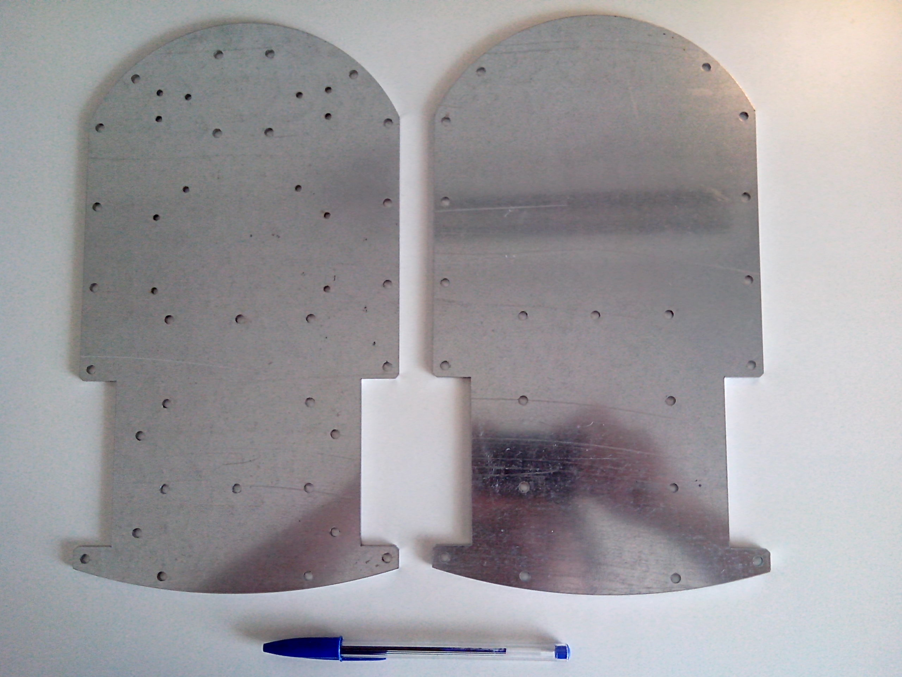

[](https://github.com/RICCIARDI-Adrien/Cyclope/actions)

# Cyclope

A little robot powered by a Raspberry Pi 3 A+, featuring a 8MPixel Raspberry Pi Camera V2 and a 360° lidar.  
A fast WiFi connection allows to remote control the robot while displaying camera real-time full HD video stream.  
A tailored Buildroot Linux distribution runs the software, controlled through WiFi through an embedded web server.


## Hardware

PCB has been designed using KiCad 5.1.5 and has been ported to KiCad 6. All manufacturing files are available from [Release](https://github.com/RICCIARDI-Adrien/Cyclope/releases) page.  
A PDF version of the schematic is also provided.

## Software

Robot's Raspberry Pi is powered by a tailored [Buildroot](https://buildroot.org) Linux distribution.

### Getting sources

Clone the repository and the submodules all in the row :
```
git clone --recurse-submodules https://github.com/RICCIARDI-Adrien/Cyclope
```

### Building

Enter repository directory, clean previous build (if needed) and generate image :
```
cd Cyclope/Software/Raspberry_Pi/buildroot
make distclean
make BR2_EXTERNAL=$(realpath ..)/cyclope cyclope_defconfig
make
```

Generated image to burn to a SD card is `Cyclope/Software/Raspberry_Pi/buildroot/output/images/sdcard.img`.

## Mechanical

Chassis is made of two overlaid 3mm-thick steel plates.  
See [Mechanical_Dimensions.odg](Chassis/Mechanical_Dimensions.odg) file for additional design information.  
Provide the `Chassis.dxf` file from [Release](https://github.com/RICCIARDI-Adrien/Cyclope/releases) page to a metal laser cutting service.

## Supply parts

See `Bill_Of_Material.csv` file from [Release](https://github.com/RICCIARDI-Adrien/Cyclope/releases) page for PCB parts. All other needed mechanical and electrical parts are listed below.

### Electrical

* 2x servomotor : [Feetech FS5113R](https://www.gotronic.fr/art-servomoteur-fs5113r-25841.htm)
* 40-pin flat cable : [Amphenol FC40150-0](https://fr.farnell.com/amphenol/fc40150-0/cordon-2-54mm-f-f-150mm-40voies/dp/2217617)
* Battery holder : [EM8](https://www.gotronic.fr/art-coupleur-8-piles-lr6-em8-5718.htm), isolate apparent contacts but battery holder ones with adhesive tape to prevent them from touching chassis spacers

### Mechanical

* Front castor wheel : [Guitel 55031100](https://fr.rs-online.com/web/p/roulettes-industrielles/3064300).
* 2x servomotor support : [ASB01](https://www.gotronic.fr/art-support-de-servos-asb01-11637.htm).
* 2x servomotor wheel : [FS5103R-W](https://www.gotronic.fr/art-roue-pour-servomoteur-fs5103r-25857.htm).
* 2x front board flat angle bracket : NFLE2012-20.
* 21x chassis plates M4x40 hex female spacer : [Ettinger 05.04.401](https://fr.farnell.com/ettinger/05-04-401/entretoise-m4x40-vzk/dp/1466794).
* 4x M2x20 screw to attach camera to front board (use three nuts per screw). Using such long screws allow to further protect the camera.
* 12x M2 nut.
* 4x M2.5x25 screws to attach Raspberry Pi to chassis bottom plate (use three nets per screw).
* 12x M2.5 nut.
* 18x M3x10 screw :
  * 8x to attach both servomotors to their support.
  * 4x to attach the two supports to chassis bottom plate.
  * 4x to attach front board flat angle brackets to chassis bottom plate.
  * 2x to attach front board to flat angle brackets.
* 4x M3x15 screw to attach motherboard to chassis bottom plate (use three nuts per screw).
* 30x M3 nut.
* 47x M4x10 screw :
  * 21x to attach female spacers to chassis bottom plate.
  * 4x to attach castor wheel to chassis bottom plate.
  * 1x to prevent battery pack from escaping from robot bottom.
  * 21x to attach chassis top plate to chassis.
* 5x M4 nut.
* Use flat washers of appropriate dimensions if desired.

## Photo gallery

### Castor wheel


### Servomotor, wheel and support


### Chassis




### PCB


### Motherboard

PCB has been soldered by hands (resistors array part was missing, I used normal 0805 resistors) :


A big capacitor has been added to keep battery voltage stable when a lot of current is required :


### Front board


With Raspberry Pi Camera V2 mounted :


### Assembled electronic boards


### Assembled robot


### Update for version 1.1 adding a 360° lidar

Chassis top plate with lidar holes :


Lidar assembled on chassis top plate :


Motherboard PCB with lidar support :


